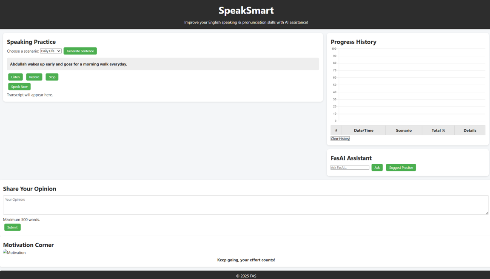
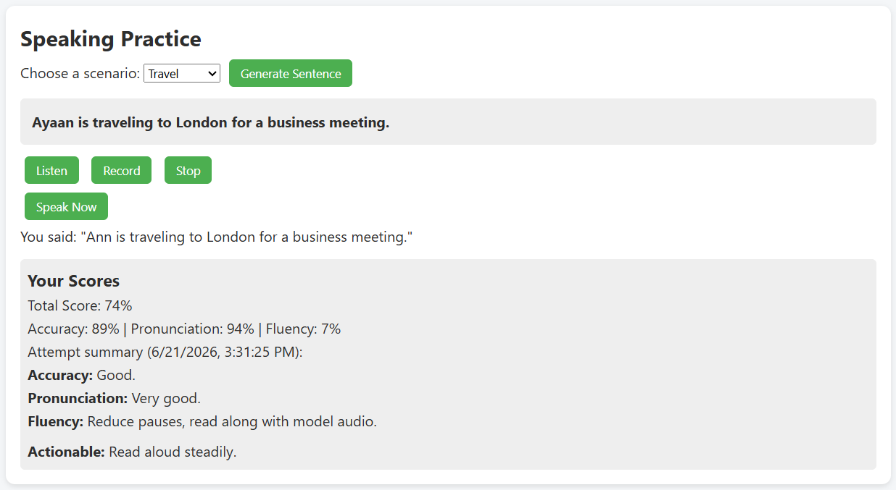
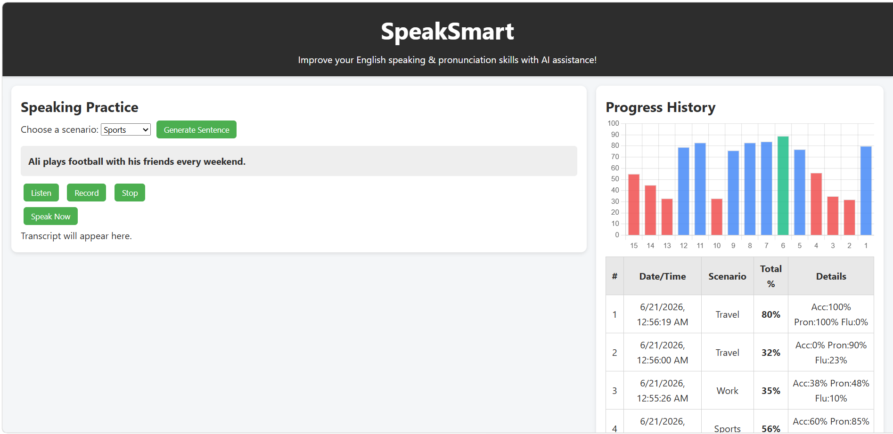

# Speak Smart

An interactive English speaking and pronunciation practice platform designed to help users improve communication skills through real-time speaking exercises and progress tracking.

## Technologies Used

- HTML5
- CSS3
- JavaScript

## Features

- Speaking practice exercises
- Pronunciation improvement
- Progress tracking dashboard
- Responsive user interface
- Interactive learning experience

## Live Website

🌐 https://abdullahfahdali.github.io/Speak-Smart/

## Screenshots

### Home Page

### Speaking Practice

### Progress Dashboard

## Author

Abdullah Fahd Ali
